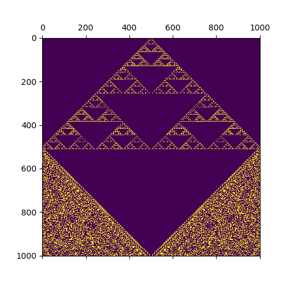
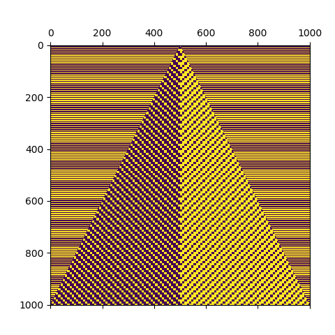
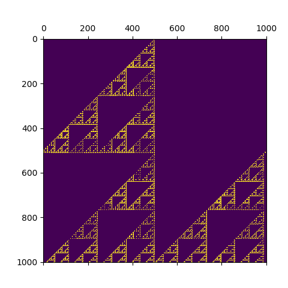
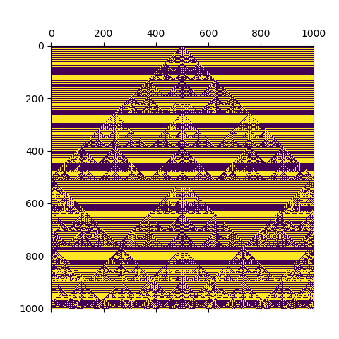

# Autómata Celular 1D

Se realizó la implementación del Autómata Celular en 1D de Stephen Wolfram. 

### Ejecución del programa

El programa recibe dos argumentos. El primero corresponde a la regla y el segundo a la cantidad de iteraciones.
```
python ca-1d.py regla iteraciones
```

 
 

 

